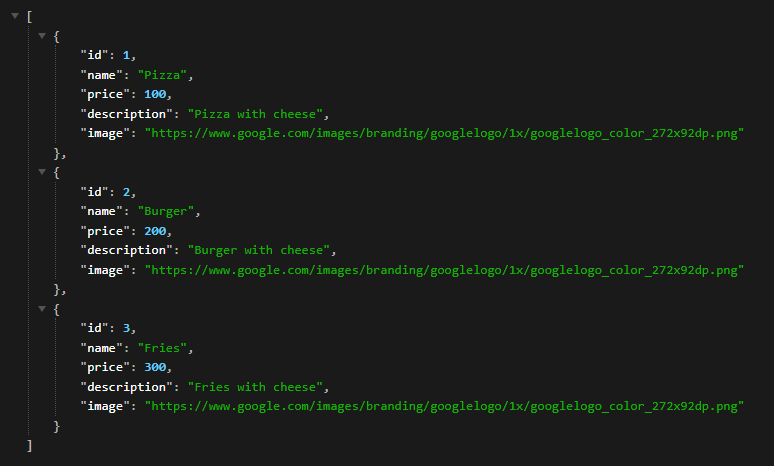

## RestoOwner

### Description
`RestoOwner` is Simple Spring Boot CRUD Api with PostgreSQL Database

***Installation***

git clone https://github.com/ivandi1980/my-restowner.git

***Payload***

```json
{
  "id": 1,
  "name": "Burger",
  "price": 599,
  "description": "Tasty",
  "image": "https://cdn.auth0.com/blog/whatabyte/burger-sm.png"
}
```


